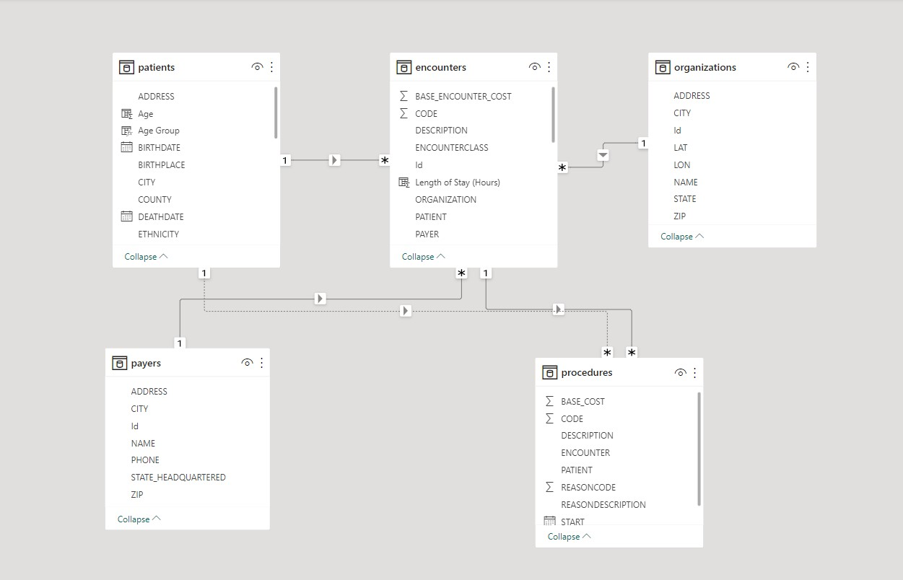
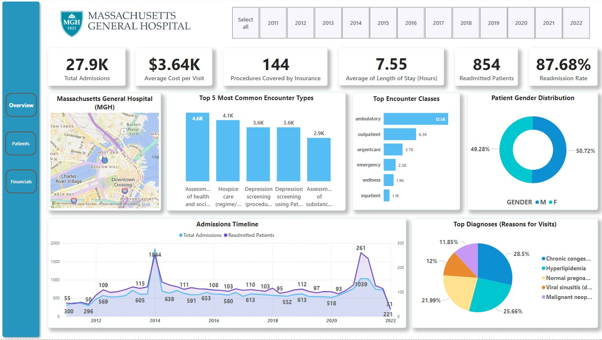

# 🏥 Power BI Hospital Analytics Dashboard – Maven Challenge

This project was created for the [Maven Analytics Hospital Challenge](https://mavenanalytics.io/challenges/maven-hospital-challenge/facee4d2-8369-4c87-a55e-e6c7ed2a42d8). The goal was to design a compelling and insightful **executive-level Power BI dashboard** for **Massachusetts General Hospital (MGH)** using patient and hospital encounter data.

---

## 🎯 Project Goals

- Provide the MGH executive team with a clear, interactive view of **hospital performance**
- Track KPIs including:
  - Total admissions
  - Average cost per visit
  - Insurance coverage
  - Readmission rates
  - Most expensive procedures
- Deliver a scalable report to support **data-driven decision-making**

---

## 🧠 Business Context

MGH required a dashboard that would:
- Offer real-time visibility into patient flow, costs, and coverage
- Summarize trends across years (2011–2022)
- Be easily explorable by stakeholders using filters and slicers

To accomplish this, I:
- Connected multiple hospital datasets
- Designed a **data model** with appropriate relationships
- Built a KPI-driven interface using **Power BI best practices**

---

## 🗺️ Data Model

<p align="center">
  
</p>

---

## 📊 Dashboard Screenshots

### 🧾 Overview Page

<p align="center">
  
</p>

---

### 💸 Financials Page

<p align="center">
  
</p>

---

### 👥 Patient Demographics Page

<p align="center">
  
</p>

---

## 🔍 Key Insights

- **🧍 27,891** total patient admissions recorded  
- **💰 $3.64K** average cost per visit  
- **⏱️ 7.55 hrs** average length of stay  
- **🔁 87.68%** readmission rate  
- **🏥 144** procedures were covered by insurance  
- **📊 Top encounter types**: health assessment, hospice care, depression screening  
- **🧾 Most expensive procedure**: Electrical cardioversion – **$25.09K** average  
- **📉 Insurance coverage** accounted for **30.63%** of total expenses  
- **📌 Highest admissions**: Q1 2014; **Highest readmissions**: Q1 2021  
- **🌍 Demographics**:
  - Avg. patient age: 69.4 years
  - 51+ age group had 68% of total admissions
  - 80%+ were non-Hispanic
  - Majority of patients were from Boston

---

## 🛠️ Tools Used

- 🧩 **Power BI** (Desktop)
- 🗃️ DAX for custom measures
- 🧱 Power BI data model relationships
- 🎨 Custom visualizations, filters, and slicers

---

## 📁 Project Structure

```
maven-hospital-challenge/
├── plots/
│ ├── Overview.jpg
│ ├── Financial overview.jpg
│ ├── Patient Information.jpg
│ └── Data_model.jpg
├── dashboard.pbix # (optional - exclude if restricted)
├── README.md
```

---

## 🔗 Project Links

- 📬 [LinkedIn Post](https://www.linkedin.com/posts/cdevarshi_mavenhospitalchallenge-data-analytics-activity-7215633705518694400-LnOR?utm_source=share&utm_medium=member_desktop&rcm=ACoAADFIar8BMwGbzdMwuKFmNJw5ffNZByR_h40)
- 👤 [My Maven Analytics Profile](https://mavenanalytics.io/profile/68e19360-5041-707d-7259-8e3c1eefd67e)
